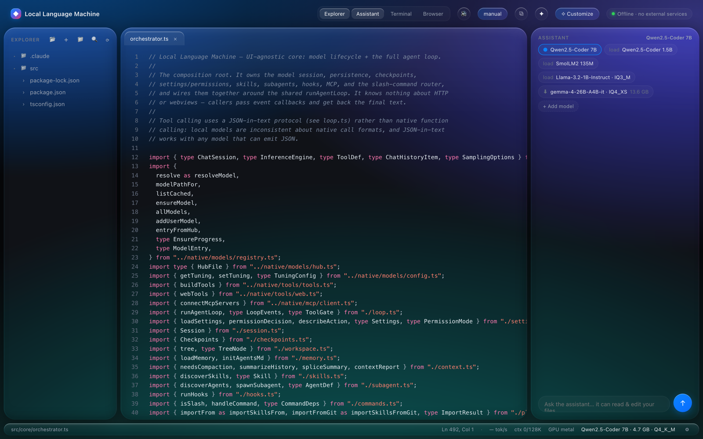
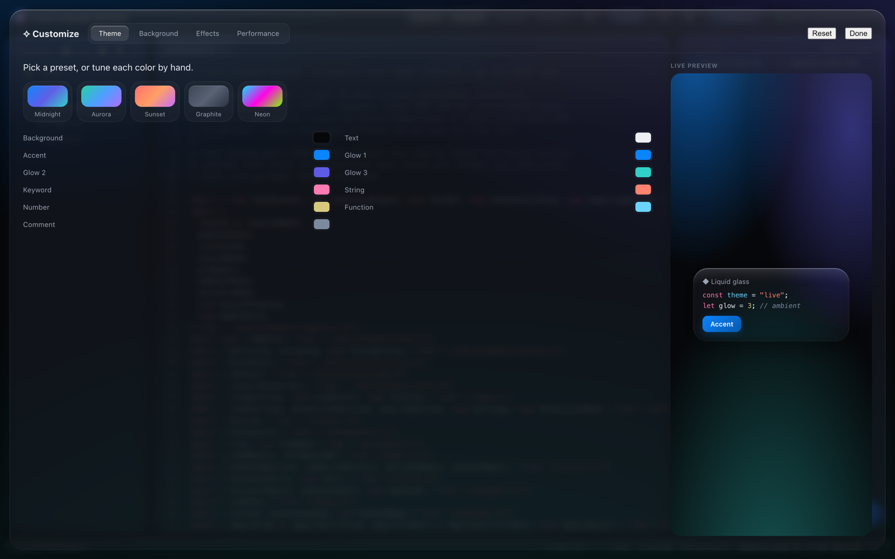
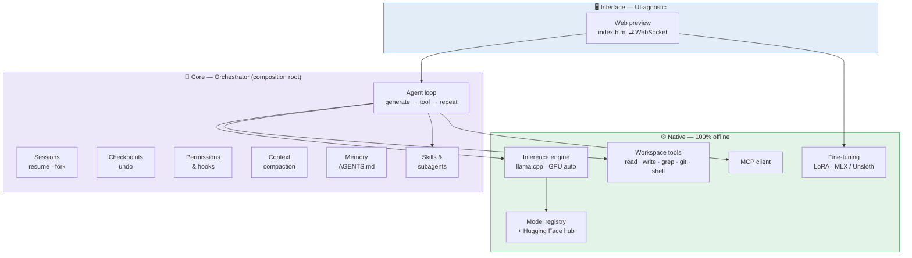
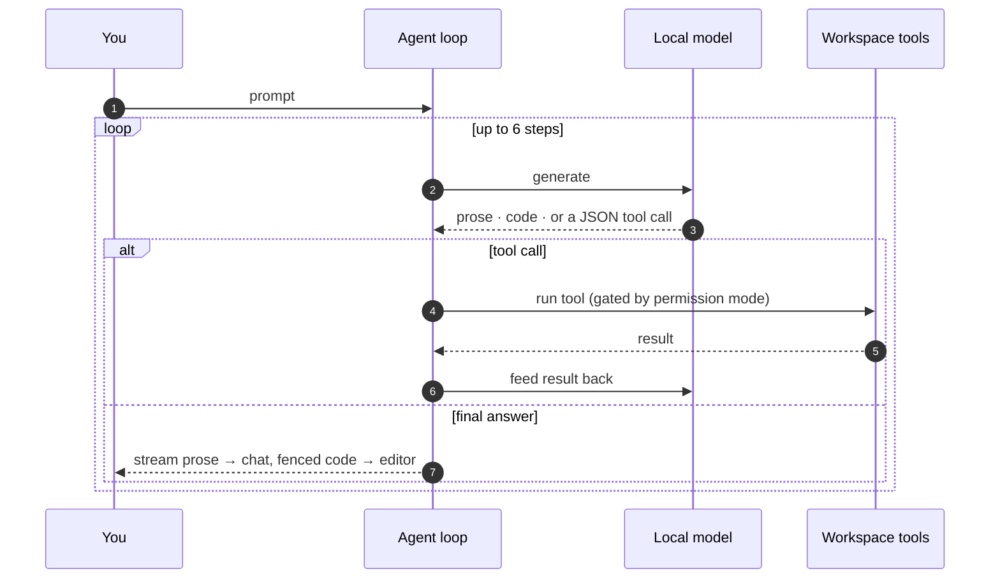
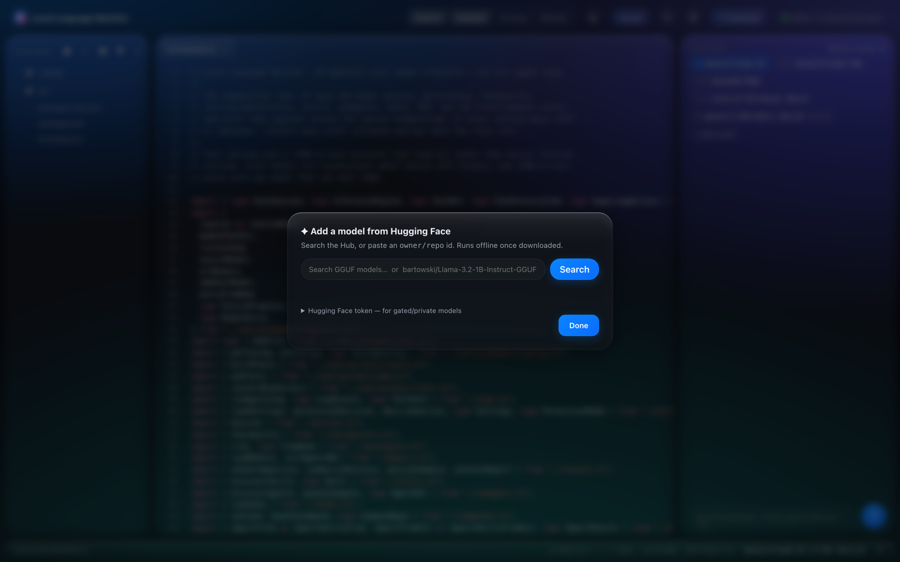
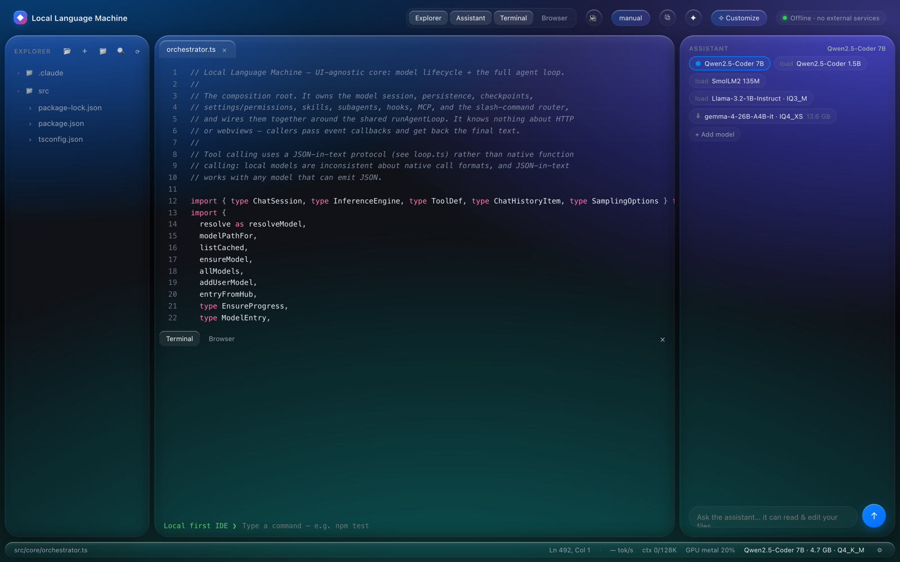
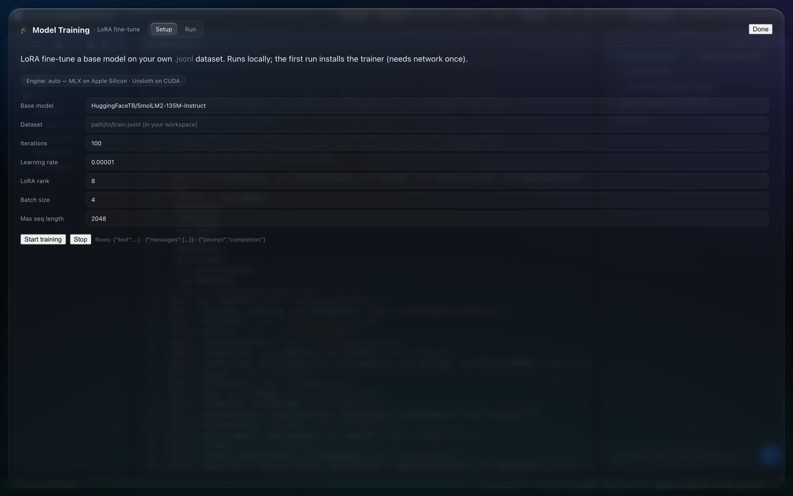
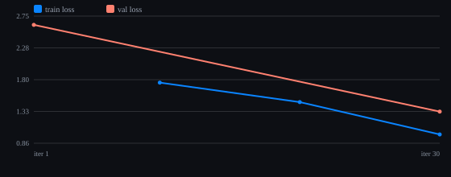

<div align="center">


# Local Language Machine

### All‑in‑one, fully offline AI coding — self‑contained inference, zero external services.

A complete AI coding IDE that runs **entirely on your own machine**. The model is bundled and
runs in‑process; your code never leaves the device; there is no API key, no account, and no
network dependency. Open a folder, load a model, and start pairing.




</div>

---

## Why

Most "AI IDEs" are thin clients for someone else's cloud. Every keystroke of context, every file
you open, and every prompt you send is shipped to a remote server. **Local Language Machine flips
that around:**

- 🔒 **Private by construction.** Inference runs in‑process. Your files, prompts, and generated
  code stay on disk — they are never sent anywhere. The network switch is **off** by default, sits
  in the status bar, and gates the assistant's reach: web tools and skill imports from a URL. The one
  component that uses the network regardless is the model manager, and only when you ask it to
  search for or download a GGUF — after which the model is cached locally and nothing else phones home.
- ⚡ **Session‑based inference.** A live context + KV cache means each turn only evaluates new
  tokens — not the whole conversation — so multi‑turn coding stays fast.
- 🧩 **Real agent, real tools.** The assistant actually reads and edits your files, runs commands,
  and searches the tree — through a permissioned tool loop, not copy‑paste.
- 🪶 **No lock‑in.** Curated models out of the box, or bring any GGUF from Hugging Face. Swap the
  backend without touching the rest of the app.

---

## Features

| | |
|---|---|
| 🧠 **Bundled inference** | `llama.cpp` runs in‑process with automatic GPU detection (CUDA · Vulkan · Metal) and a clean fallback to CPU. |
| 🛠️ **Agentic tool loop** | Read, write, `grep`, `glob`, run a terminal command, and drive `git` — every path sandboxed to the workspace root. |
| 🎚️ **Permission modes** | `manual`, `accept‑edits`, `plan`, and `auto` — with a dangerous‑command guard and an explicit allow‑list. |
| ⏪ **Checkpoints** | Every model write is snapshotted first, so a single undo rewinds file edits — independent of git. |
| 🗜️ **Context compaction** | Long sessions auto‑summarize older turns to stay inside the model's context window. |
| 📎 **Project memory** | Drop an `AGENTS.md` at the root and its conventions ride along in every request. |
| 🧭 **Skills & subagents** | Reusable, `/slash`‑invocable skills and isolated read‑only research subagents. |
| 🔌 **MCP & hooks** | Connect Model Context Protocol servers and fire shell hooks on lifecycle events. |
| 🤗 **Model manager** | Search the Hugging Face Hub or paste an `owner/repo` id; resumable download + SHA‑256 verify. |
| 🎓 **On‑device fine‑tuning** | Built‑in LoRA training — MLX on Apple Silicon, Unsloth on NVIDIA — with live loss streamed to the UI, plus a runs history. |
| 📊 **Benchmark & evaluate** | Measure base vs fine‑tuned on real held‑out data — perplexity, generation speed, and side‑by‑side samples — rendered as charts. Convert a run to GGUF and load it right back into the Assistant. |
| 🎨 **Themeable UI** | A flat olive design system with light and dark presets, per‑colour overrides, and custom code‑driven backgrounds. |
| 💻 **Integrated dock** | A built‑in terminal and a live browser panel for previewing what you build. |
| 🔀 **Sessions** | Resume, fork, and clear conversations — history is persisted per project. |

<div align="center">

<br/><em>Customize everything — theme presets, per‑token syntax colors, and a live glass preview.</em>
</div>

---

## Architecture

A UI‑agnostic core sits between any front‑end and a bundled native layer. The **Orchestrator** is
the composition root; nothing in the core knows about HTTP or webviews.



### How a turn works

Tool calling uses a **JSON‑in‑text protocol** rather than native function calling — local models
are inconsistent about native call formats, and JSON‑in‑text works with anything that can emit JSON.



---

## Install

Grab the build for your platform from the [latest release](https://github.com/siroxou/local-language-machine/releases/latest):

| Platform | File |
|----------|------|
| macOS (Apple Silicon) | `.dmg` — open it and drag the app to Applications |
| Windows | `.exe` installer |
| Linux | `.AppImage` — `chmod +x` and run |

Or, if you already have Node ≥ 22, skip the installer — this serves the same UI in your browser
and needs no code signing, so macOS never gets in the way:

```bash
npx local-language-machine    # the folder you run it in becomes the workspace
```

Launch it, then load a model from the Assistant panel. The first load downloads the model once
into `~/.local-language-machine` and caches it there; nothing else touches the network.

The app checks for a newer release on launch and points you at the download page when one exists.

### macOS: “Apple could not verify this app is free of malware”

The build is ad‑hoc signed but not notarized — notarization needs a paid Apple Developer
account. macOS therefore quarantines it on download and Gatekeeper refuses the first launch.
Press **Done** on that dialog (not “Move to Trash”), drag the app to **Applications**, then
clear the quarantine flag:

```bash
xattr -dr com.apple.quarantine "/Applications/Local Language Machine.app"
```

Or skip the installer entirely — `npx local-language-machine` never gets quarantined, because
the flag is set by the browser that downloads a file, not by npm.

It opens normally from then on. Prefer not to use the terminal? Double‑click the app, dismiss
the warning, then go to **System Settings → Privacy & Security**, scroll to **Security**, and
press **Open Anyway** next to the app's name.

> Right‑click → **Open** no longer works for this: Apple removed that bypass in macOS 15
> (Sequoia). Older write‑ups still recommend it, but on macOS 15 and later it just replays the
> same refusal.

**Windows** shows a SmartScreen notice instead — **More info → Run anyway**. **Linux** needs
`chmod +x` on the AppImage.

---

## Run from source

> **Requirements:** Node ≥ 22. A GPU is used automatically when present, but everything runs on CPU too.

```bash
npm install     # the inference engine is bundled — no extra services
npm run preview # serves the UI at http://127.0.0.1:7433
```

Other scripts:

```bash
npm test            # run the test suite
npm run typecheck   # strict TypeScript, no emit
npm run app         # build, then run the desktop shell without packaging
npm run pack        # build a local .app in release/ (no publishing)
```

### Cutting a release

```bash
npm version patch
GH_TOKEN=<token> npm run release   # builds and publishes the macOS artifact
git push --follow-tags             # CI builds and attaches Windows + Linux
```

Windows and Linux artifacts are built by CI rather than locally, because the inference engine
ships per‑platform prebuilt binaries that only install on their matching host.

---

## Models

Curated, coding‑focused defaults ship in the registry. The best cached model auto‑loads on startup.

| Model | Params | Quant | Size | Notes |
|-------|:------:|:-----:|:----:|-------|
| **Qwen2.5‑Coder** | 7B | Q4_K_M | ~4.7 GB | Default — best quality |
| **Qwen2.5‑Coder** | 1.5B | Q4_K_M | ~1.0 GB | Fast, tool‑capable |
| **SmolLM2** | 135M | Q4_K_M | ~0.1 GB | Smoke test / low‑RAM |

…or add **any GGUF** from the Hugging Face Hub — search inside the app or paste an `owner/repo` id.
Downloads are resumable and verified against a pinned SHA‑256 when one is set.

<div align="center">

</div>

---

## Slash commands

| Command | Does |
|---------|------|
| `/help` | List commands and available skills |
| `/model [id]` | Show or switch the loaded model |
| `/context` | Token / context‑window usage |
| `/compact [focus]` | Summarize older turns to free context |
| `/clear` | Start a fresh session |
| `/init` | Scaffold an `AGENTS.md` for project memory |
| `/resume [id]` | List or resume a saved session |
| `/fork` | Branch the current session |
| `/<skill>` | Invoke any installed skill by name |

---

## The agent's tools

| Tool | Purpose |
|------|---------|
| `read_file` · `list_dir` | Read files and browse the tree |
| `grep` · `glob` | Search contents by regex, or find files by pattern |
| `write_file` | Create/overwrite a file (checkpointed first) |
| `run_terminal` | Run a shell command in the workspace root |
| `git` | Read‑only subcommands run directly; mutating ones ask first |
| `task` | Delegate a focused, read‑only job to an isolated subagent |
| `web_search` · `web_fetch` | Online research — **only** when online mode is enabled |

Every file path is resolved **inside** the workspace root; escapes are rejected. Mutating actions
pass through the permission gate before they run.

<div align="center">

<br/><em>An integrated terminal and live browser panel sit right under the editor.</em>
</div>

---

## Extending it

- **Skills** — a folder with a `SKILL.md` (frontmatter + body). Descriptions are injected into the
  system prompt; the body loads on demand when the skill is invoked or matched. Import from a local
  folder (offline) or a git URL (online).
- **Subagents** — Markdown agent definitions that run the same loop in an isolated context with a
  safe, read‑only toolset by default.
- **Hooks** — shell commands fired on `SessionStart`, `UserPromptSubmit`, `PreToolUse`,
  `PostToolUse`, and `Stop`.
- **MCP** — point the app at local (stdio) Model Context Protocol servers to add tools; a failing
  server never blocks the session. Remote SSE/HTTP servers are not supported yet.

---

## Fine‑tuning & evaluation (LoRA)

Teach a model your codebase or house style **locally**. The built‑in trainer runs LoRA fine‑tuning
with the right backend for your hardware — **MLX** on Apple Silicon, **Unsloth** on NVIDIA — and
streams live loss into the UI. Point it at a `.jsonl` dataset (rows of `text`, `messages`, or
`prompt`+`completion`) **or paste a Hugging Face dataset id** (fetched and converted for you),
choose a base model, and start. Every run is saved with its metadata under a **Runs** history, and
the first run bootstraps a dedicated Python venv automatically (the one online moment, just like the
initial model download).

<div align="center">

</div>

Training defaults are chosen so a run is honest by default: loss is computed on the **answer only**
(not the prompt), the split is **seeded and de‑duplicated**, and when the run finishes the
**lowest‑validation‑loss checkpoint is promoted** over the final one. That last point matters more
than it sounds — MLX writes numbered checkpoints but loads `adapters.safetensors`, so a run that
peaks at iteration 150 and overfits through 300 would otherwise ship the worse adapter.

### Benchmark it — real metrics, real charts

The **Evaluate** tab scores your fine‑tuned model against the base on a held‑out split, on‑device,
and renders it as inline SVG (no chart library). It reports four things, in the order you should
trust them:

| Metric | What it is | Comparable across models? |
|---|---|---|
| **Multiple choice** | Teacher‑forced: each candidate answer scored, lowest loss wins | **Yes** — immune to verbosity |
| **Free‑text accuracy** | Generated answer graded against a closed set of candidates | Mostly — verbosity‑sensitive |
| **Bits per byte** | Loss over the answer's UTF‑8 bytes | **Yes** — same denominator for every tokenizer |
| **Perplexity** | Per‑token, completion‑only | **No** — depends on the tokenizer |

Grading scans the output for members of a known closed answer set on word boundaries, rather than
normalising and substring‑matching. The naive approach is quietly wrong on real data: stripping
articles makes *"Hepatitis A"* match *"Hepatitis B"*, and stripping punctuation makes *"12.5 mg"*
contain the distractor *"25 mg"*. Answers are graded **correct / wrong / abstain / ambiguous**, so a
model that declines to answer is never scored the same as one that guesses wrong.

<div align="center">

</div>

Sample generations are drawn from the **held‑out set** and shown next to the reference answer, so
you are comparing against ground truth rather than eyeballing style drift on unrelated prompts.

When you're happy with a run, **Convert & add** fuses the adapter and exports a GGUF that loads
straight back into the Assistant — so you can chat with the model you just trained.

### Sweep a model matrix

`bench/` runs the same dataset and hyperparameters across many models and writes one comparison
report. It runs as a standalone process so a multi‑hour sweep survives closing the browser, and it
checkpoints after every cell, so re‑running resumes instead of restarting.

```bash
npm run bench:data     # generate the synthetic evaluation corpus
npm run bench          # run every cell in bench/matrix.json
```

The bundled corpus is a **fully invented clinical domain** — every compound, class and marker is
coined, and the generator asserts that no answer shares a 4‑gram with its own entity name, so
nothing is guessable from morphology. Because the domain cannot appear in any pretraining set, base
models score at chance by construction and any gain is provably from the fine‑tune. Four suites
measure different things: recall of trained facts under unseen phrasing, generalisation to a second
phrasing, two‑hop composition that is never trained directly, and entities held out entirely
(a hallucination check).

Running it across three families and a 55× size range ([full report](bench/results/report.md)):

| Model | Params | Recall | Composition |
|---|---:|---:|---:|
| SmolLM2‑135M | 0.135B | 50% | 21% |
| SmolLM2‑360M | 0.362B | 72% | 17% |
| Qwen2.5‑0.5B | 0.494B | 100% | 17% |
| Falcon3‑1B | 1.669B | 83% | 17% |
| SmolLM2‑1.7B | 1.711B | 94% | 21% |
| Qwen2.5‑3B | 3.090B | 98% | 17% |
| Falcon3‑3B | 3.228B | 90% | 17% |
| Falcon3‑7B | 7.456B | 100% | 29% |
| Qwen2.5‑7B | 7.620B | 100% | 21% |

Recall climbs steeply below 0.5B and saturates above it. Composition never leaves the 25% chance
line at any size — both hops are trained separately and no model joins them. Three seeds of the same
cell give a **±4.8pt** run‑to‑run spread, which is the noise floor any comparison has to clear.

---

## Project layout

```
src/
├─ core/           UI-agnostic brain
│  ├─ orchestrator.ts   composition root — wires everything to the agent loop
│  ├─ loop.ts           the reusable generate → tool → repeat loop
│  ├─ session.ts        persisted conversation history
│  ├─ checkpoints.ts    file-edit snapshots (undo)
│  ├─ settings.ts       permission modes, allow-list, hooks, MCP
│  ├─ context.ts        token accounting + compaction
│  ├─ memory.ts         AGENTS.md / MEMORY.md loading
│  ├─ skills.ts         skill discovery + frontmatter parsing
│  ├─ subagent.ts       isolated-context workers
│  └─ commands.ts       slash-command router
├─ native/         offline building blocks
│  ├─ inference/        the bundled engine abstraction
│  ├─ tools/            file / grep / git / terminal / web tools
│  ├─ models/           curated registry + Hugging Face hub
│  ├─ training/         LoRA trainer, benchmarker, and GGUF export
│  └─ mcp/              Model Context Protocol client
└─ preview/        localhost web UI (server + single-page app)

bench/
├─ gen-dataset.ts   deterministic synthetic-corpus generator (no RNG, self-checking)
├─ matrix.json      the model matrix + shared hyperparameters
├─ run-matrix.ts    resumable sweep runner → experiment.json + report.md
└─ results/         committed reports from the runs described above
```

---

## Roadmap

- [ ] VS Code webview front‑end (the core already speaks a postMessage‑style protocol)
- [ ] Nested project‑memory discovery
- [ ] Remote (SSE/HTTP) MCP transport — local stdio servers work today
- [ ] HTTP / prompt / subagent hook types
- [ ] Mutating subagents with per‑agent model overrides
- [ ] Full PTY terminal (interactive `vim` / `top`)

---

## License

No license has been chosen yet — all rights reserved by default. Add a `LICENSE` file if you want
others to reuse the code.
