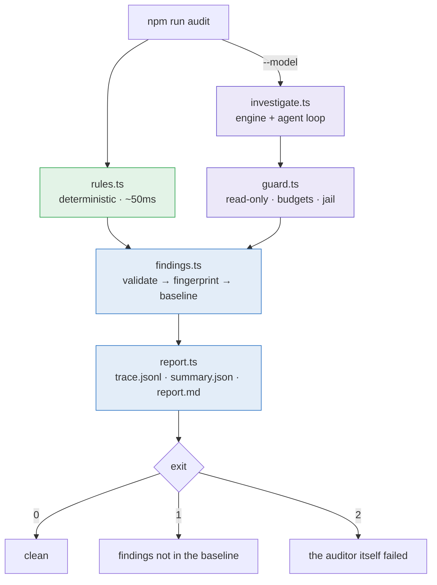

<div align="center">

# Self‑audit

### The project checking its own source.

</div>

---

## Why

Two gaps made each other worse.

Nothing verified the code: `.github/workflows/` held one workflow, triggered on a `v*` tag,
which went from `npm ci` straight to `electron-builder`. It never ran `npm test` or
`npm run typecheck`. Those take under three seconds together — the gate existed and gated
nothing, so a tag could package and publish a tree no assertion had ever run against.

And nothing observed it: there was no logger, no event emitter, and no trace anywhere in
`src/`. The only durable record of what the agent did was `events.jsonl`, carrying four
event types with no step index, no latency, and no record of what the permission gate
decided.

The project already ships a capable local agent — a tool loop, a permission seam, a
read‑only tool set, and in‑process inference. It used none of it on itself. The audit is
that capability, pointed inward.

---

## The two passes

| | |
|---|---|
| 🔍 **Deterministic** | Invariant checks over the source. No model, no dependencies, no network. Runs in ~50 ms and gates CI. |
| 🧠 **Model‑driven** | Fixed lines of inquiry run through the bundled engine, aimed at what a regex structurally cannot see. Opt‑in, local, and **never** gates. |



CI runs the deterministic pass only, and that is a decision rather than an omission. A
hosted runner has no GPU and a cold multi‑gigabyte download; a quantised model decoding on
CPU would cost minutes to produce worse precision than the regexes. The model‑driven pass
belongs on the machine that already has the weights.

---

## Running it

```bash
npm run audit                              # deterministic pass over the working tree
npm run audit:ci                           # same, exits 1 on anything not baselined
npm run audit -- --model qwen2.5-coder:7b  # add the model-driven pass
npm run audit -- --write-baseline          # seed audit/baseline.json from this run
```

| Flag | Default | Does |
|------|---------|------|
| `--root` | cwd | Tree to scan |
| `--out` | `audit/last` | Where the three artifacts land |
| `--baseline` | `audit/baseline.json` | The ledger of accepted findings |
| `--check` | off | Exit 1 on findings absent from the baseline |
| `--model` | off | Run the model‑driven pass with this model id |
| `--write-baseline` | off | Write every current finding into the baseline |

**Exit codes.** `0` clean · `1` findings not in the baseline · `2` the auditor failed its
own self‑checks, or crashed. The third is separate on purpose: "the code is broken" and
"the tool is broken" must not arrive as the same signal, or a broken tool reads as a
broken codebase.

---

## The rules

Each one asserts a property the codebase **already holds at every site but one or two**.
Three of four `spawn` calls attached an error listener; three of five `fetch` calls passed
a signal. That is what separates an invariant from a style rule — it names discipline that
already exists and stops it eroding, so it can be enforced without asking anyone to change
how they write code.

| Rule | Sev | What it caught when first run |
|------|:---:|-------------------------------|
| `spawn-no-error-listener` | high | `mcp/client.ts` — `'error'` fires asynchronously, so the surrounding `try/catch` never saw it and one misspelled server command took the whole app down |
| `tool-handler-unjailed-fs` | high | `tools/tools.ts` — the `glob` tool handed the model's pattern straight to `fs` with only a `cwd`, and a `cwd` is not a boundary |
| `ws-server-no-origin-check` | high | `preview/server.ts` — the control socket accepted any connection, and it reaches `spawn(…, {shell: true})` |
| `fetch-no-timeout` | med | three call sites, while three others already passed `AbortSignal.timeout` |
| `download-without-integrity` | med | a remote Python script fetched and then executed |
| `layering-violation` | med | nothing — it locks in an architectural claim the README makes, which was already true |
| `regexp-non-literal-source` | med | three patterns built from wire or model input, run over every file on the thread that serves the UI |
| `innerhtml-interpolated` | med | sixteen sites; the ones that mattered interpolated Hub metadata, server error strings, and model‑chosen tool names |
| `promise-timer-never-cleared` | low | an RPC deadline never disarmed, so every answered call held a live timer for 20 s |

### Rules deliberately not shipped

The most important table here. **A bad rule is worse than no rule**, because it teaches
people to ignore the tool.

| Not a rule | Why | What owns it instead |
|------------|-----|----------------------|
| Empty `catch {}` | All eleven occurrences are intentional and commented. A rule that is 100 % false positives on day one gets muted, and takes the useful rules with it | Human reading |
| File length / "god file" | Measures a proxy for the thing rather than the thing. `orchestrator.ts` is long because composition roots are long | Nothing. Don't measure it |
| Registry checksum pinning | A property of *data in the repo*, decidable by running one line | A test in `registry.test.ts` |
| Symlink jail escape | "Does this call realpath" is trivially satisfiable without being correct | A test that creates a real symlink |
| Budget returning a falsy value | Purely semantic; any regex for it is noise | A test with a stub that never stops calling tools |
| Wire input reaching `path.join` | Needs interprocedural taint tracking across two files. Any local approximation either misses it or fires on all forty `join()` calls | A test asserting the id is rejected |
| Unchecked index access | A scanner would relitigate, worse, what the type system already models | `noUncheckedIndexedAccess`, once its ~48 errors are worked down |

Four of those became tests during the first campaign. That is the intended direction: when
a class can be decided by running code, run code.

---

## Guardrails

Stated as what is **structurally impossible**, not what is discouraged.

| | |
|---|---|
| 🚫 **No mutating tools exist** | `buildTools` is called with no `exec`, and only `read_file`/`list_dir`/`grep`/`glob` are kept. The loop derives its valid set from the keys it was given, so a hallucinated `write_file` cannot resolve. An absent capability needs no denylist |
| 🔒 **Physical path jail** | Every path argument passes `resolveInRoot`, which resolves symlinks before comparing. This began as a hardened local copy while the shipped one compared strings; that is fixed at the source now, so the audit delegates rather than keeping a second implementation that could drift |
| ⏱️ **Hard budgets** | Steps, wall‑clock and tokens, enforced at the gate. Exhaustion **blocks with a reason** rather than throwing, so the run winds down and the reason reaches the report. A per‑step generation cap is part of the budget, not a detail: the gate only runs *between* tool calls, so a generation that never emits one is unbounded — the first version of this hung for twenty‑five minutes on a 135M model rambling toward a 32k context while the wall‑clock check waited for a turn it never got |
| 🌐 **No network** | No web tools, no MCP, no delegation |
| ✅ **Corroborated output** | A finding is dropped and counted unless its file and line exist **and** the evidence it quotes is actually in that file. Checking only that the citation is well‑formed proved far too weak — a model that read nothing still produced findings against real paths at line 1 |

That last one is what makes a small local model usable at all. Run against `smollm2:135m`,
the model emitted 152 candidate findings without making a single tool call, and all 152 were
dropped — a reported precision of zero rather than 152 fabrications in a report. That number
is the point: the audit does not need the model to be good, it needs to know how good it was.

---

## Observability

Three artifacts per run, in `--out`. The trace reuses the same append‑a‑line shape as the
session transcript rather than introducing a logging abstraction — adding a logger to the
product in order to watch a dev tool would be backwards.

**`trace.jsonl`** — one record per event:

```json
{"t":1755193842011,"phase":"investigate","question":"resource-lifecycle","step":2,
 "tool":"grep","args":"{\"pattern\":\"setInterval\"}","gate":"allow","tokens":4187}
```

Arguments are truncated to 200 characters, not hashed. A digest of a grep pattern helps
nobody reading a trace at 3 a.m.

**`summary.json`** — counts by severity, rule and origin; budgets and exhaustion; timings;
`droppedInvalid`; `jailRejections`; and the self‑check results. The ratio
`droppedInvalid / emitted` is the trust signal for the model‑driven pass: it says, per run
and with a number, how much of what came back was real.

**`report.md`** — the human artifact: new, baselined, resolved.

### Self‑invariants

The auditor asserts things about its own run, re‑reading the trace it just wrote so what
gets validated is the artifact a person will actually read. Any failure is exit 2.

1. No tool outside the read‑only set appears anywhere in the trace.
2. Every blocked call recorded a reason.
3. **If any budget was hit, the summary says so.** This is the one that matters: the defect
   that started this work was an agent loop returning an empty string when it ran out of
   steps, which was then persisted as a finished answer. A bug‑finder that reports "nothing
   found" when it means "I stopped early" is worse than no bug‑finder, so the audit is
   structurally forbidden from doing it.
4. Every reported finding is uniquely fingerprinted.
5. The counts add up.
6. The trace has no unparseable line — a torn one means the run died mid‑write.

---

## The baseline

`audit/baseline.json` is the ledger of what the gate currently accepts. It is **a deferral
record, not an absolution**.

```json
{ "accepted": { "be87a704e94c": { "rule": "…", "file": "…", "note": "why this is accepted" } } }
```

**Every entry needs a non‑empty note, or the audit refuses to run at all.** That single
constraint is what stops the file decaying into a suppression dump where entries accumulate
and nobody remembers why. One sentence per entry is the whole price.

Fingerprints are `sha256(rule + file + evidence)` and **deliberately exclude the line
number**. Adding an import shifts every line beneath it; a line‑keyed baseline would report
all of them as new, turning the gate red for reasons nobody caused — and a gate that cries
wolf is one people learn to route around. The cost is that two byte‑identical violations in
one file collapse to a single entry, which is the right trade: they are the same defect
twice.

A finding in the baseline with no match in the tree is reported as **resolved** and does
*not* fail the build. Failing on a bug someone just fixed is how a gate gets disabled.

### Annotating a false positive

For a line that is genuinely fine, in the code rather than in a JSON file:

```ts
// audit-ok(regexp-non-literal-source): the interpolated handle name is regex-escaped inline
```

The rule id and a non‑empty reason are both required — a bare `audit-ok` suppresses nothing,
for the same reason a baseline entry needs a note. A test asserts that no annotation in the
tree names a rule that does not exist, so a typo cannot silently suppress.

---

## Severity

**Reachability, not vulnerability class.** The question is how short the path is from
untrusted input to the code, on a loopback‑bound single‑user desktop app.

| | Reachable from |
|---|---|
| **S1** | a web page the user merely visits |
| **S2** | model output alone |
| **S3** | a hostile remote response |
| **S4** | local misconfiguration, or a second connected client |

Nothing is inflated for requiring local code execution — a process already running as the
user does not need a bug to do damage. The first campaign's headline was an S1 **chain**
rather than any single finding: no origin check on the control socket, plus a message that
re‑roots the workspace to any absolute path, plus a message that spawns a shell. Each link
alone reads as "a localhost server is permissive". Together, any page the user visited got
code execution. Rank chains, not links.

---

## The procedure

Re‑runnable, not a record of one campaign.

1. **Establish the gate.** Nothing else matters if a fix can silently regress. *Done when a
   pull request that inverts one assertion shows a red required check — if it goes green,
   the gate does not exist regardless of what the YAML says.*
2. **Raise the floor with the compiler.** A flag is a rule nobody has to write, tune, or
   maintain. Turn on what is free; put what is not on a ratchet that may fall and never
   rise. *Done when typecheck is clean.*
3. **Write rules only for what the compiler cannot see.** The test: *can you name the day
   it broke and what broke because of it?* If not, it is a style rule. *Done when a
   deliberately introduced violation of each rule exits 1.*
4. **Sweep with the model.** Rules find only what someone thought to encode. **One pass per
   lens across all files — never one pass per file across all lenses.** A file‑major sweep
   re‑reads a file with a wandering question and finds the same shallow things repeatedly.
   Holding one question fixed is what makes *comparisons* visible, and every defect found
   so far was a comparison finding: this call site lacks the guard its four siblings have.
   *Done when each lens has produced a written list — including an explicit "none found",
   because a lens with no output is indistinguishable from one that never ran.*
5. **Verify adversarially.** Candidates are not findings. Each one exits reproduced,
   downgraded, or withdrawn, and the proof is a runnable command or a failing test, not an
   argument. Shipping candidates destroys trust in the whole exercise — the first two people
   who chase a theoretical finding stop reading the list.
6. **Triage and baseline.** Severity by reachability. Anything not fixed gets a note.
7. **Fix with a regression test.** Write the test and **watch it fail on the parent
   commit**; a regression test never seen red is decoration. Then fix at the chokepoint, not
   the reported site — grep every caller first. One guard inside `resolveInRoot` was a
   smaller diff than a guard at each of its nineteen call sites, *and* it covered the
   callers nobody remembered.

### The lenses

- **Trust boundaries** — the four crossings: the WebSocket wire, model‑chosen tool
  arguments, the workspace root, and network responses. For each: where is the validation,
  is it before or after first use, and is it the only path in?
- **Resource lifecycle** — every spawn, timer, socket, server and inference context. Who
  releases it, on all four exits: success, thrown error, client disconnect, process exit?
- **Shared mutable state** — every module‑level `let`. What breaks with two browser tabs?
  What breaks when a message arrives mid‑turn? Where is there check‑then‑act across an
  `await`?
- **Parser and protocol edges** — every hand‑written parser gets adversarial input. What
  does an unterminated frame do? What grows without bound?
- **Error paths** — read every `catch`. Is state consistent afterwards, and does anyone
  learn it happened? An intentional empty catch with a comment is not a defect.
- **Limit signalling** — every cap and budget. Can the caller tell a truncated result from
  a complete one?
- **Platform and path semantics** — Windows drive‑relative paths and case‑insensitive
  prefixes; macOS case‑insensitivity and `/tmp` being a symlink; and paths containing
  spaces, which this checkout has.

---

## Limits

Stated plainly, because a tool that oversells itself is worse than one that doesn't.

- **The deterministic pass is regex over prepared source.** No AST, no data flow, no type
  information. It asserts that a safety concept is *present* — never that it is *correct*.
  `ws-server-no-origin-check` confirms a file mentions `verifyClient`; whether that check
  is right is a job for a test.
- **A green audit means "no new findings", not "no findings."** Pre‑existing ones are in the
  baseline, with notes.
- **The model‑driven pass is a hint list.** Precision at 7B is not good. It is usable
  because every citation is verified against the tree and the discard count is published;
  read `droppedInvalid / emitted` before trusting a run.
- **`safeRegExp` reduces catastrophic backtracking rather than eliminating it.** No string
  test decides this in general and JavaScript has no match timeout. The complete fix is to
  evaluate untrusted patterns on a worker thread where a runaway match can be killed.
- **CI does not execute the server or the Electron shell.** No fuzzing, no coverage
  measurement.
- **Two byte‑identical violations in one file share a fingerprint** — a deliberate
  consequence of leaving line numbers out.

---

## Adding a rule

`RULES` is an array in `src/audit/rules.ts`. There is no config file and no plugin loader —
a configuration layer over nine rules would be more code than the rules.

```ts
{
  id: "my-rule",
  severity: "medium",
  message: "What is wrong and what it causes.",
  include: /^src\/.*\.ts$/,        // tested against the repo-relative, forward-slashed path
  scan(src, code, path) { … },     // `code` has comments and string bodies blanked
}
```

Scan `code`, report against `src`. That is what `stripped()` is for: it blanks the
*contents* of comments and string literals while preserving every offset and newline, so a
match index still maps to the right line. Without it the audit reports itself — this file
names `fetch(` and `spawn(` in prose, and the rules describe their own patterns in comments.

Then add a fixture test with a hit **and a near‑miss**. The near‑miss is the important half:
a rule that cannot tell a compliant call from a defective one is noise with extra steps.
Measure the hit count on the real tree before shipping, and if it is high, say so in the
report rather than shipping a rule nobody will read.
